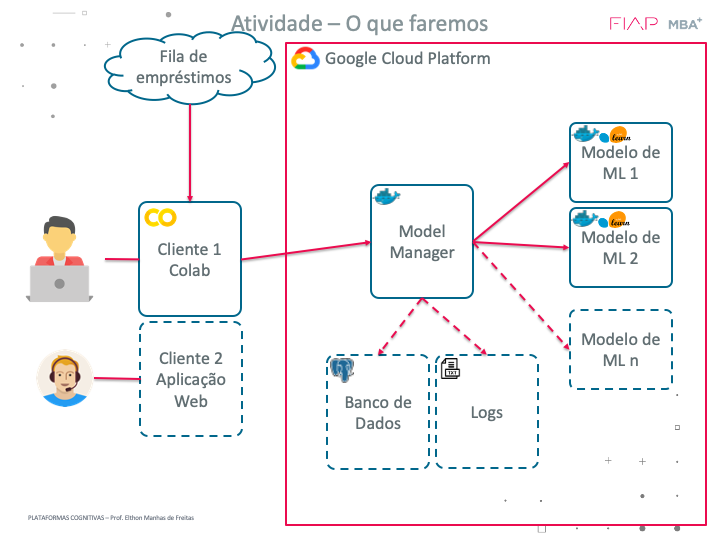

# Atividade de Plataformas Cognitivas Docker  
__Prof. MSc. Elthon Manhas de Freitas__  



Repositório para as atividades de plataformas cognitivas ligadas a Serving em Containers usando o Docker


Informações gerais:
`Python 3.7`

## 1. Gerar imagem do serviço:


```
docker build -t platserver -f dockerbuilds/DockerServer.txt .
```

## 2. Criar e rodar os Contêineres:

Criar uma rede que será compartilhada entre todos os conteineres:  
```
docker network create plat_network
docker network inspect plat_network
```

Apenas entrar no contêiner, sem executar nada:
```
docker run -it --network plat_network -p 8080:8080 -v $(pwd)/config:/myServer/config platserver /bin/bash
```

Criar e rodar microconteineres para os modelos preditivos:  
```
sudo docker run -d --network plat_network -p 10001:8080 --restart always --name serving01 platserver python servingmodel.py models/modelo01.joblib 8080
sudo docker run -d --network plat_network -p 10002:8080 --restart always --name serving02 platserver python servingmodel.py models/modelo02.joblib 8080
```

Criar e rodar container de gerenciador de modelos:  
```
bash geraconfig.sh
docker run -d --network plat_network -p 443:8080 --restart always -v $(pwd)/config:/myServer/config -v $(pwd)/Log:/myServer/Log --name modelmanager platserver python modelmanager.py 
docker run -it --network plat_network -p 443:8080  -v $(pwd)/config:/myServer/config -v $(pwd)/Log:/myServer/Log --name modelmanager platserver /bin/bash

```

Ok, se até aqui tudo estiver certo, pode começar a utilizar a plataforma para fazer predições.